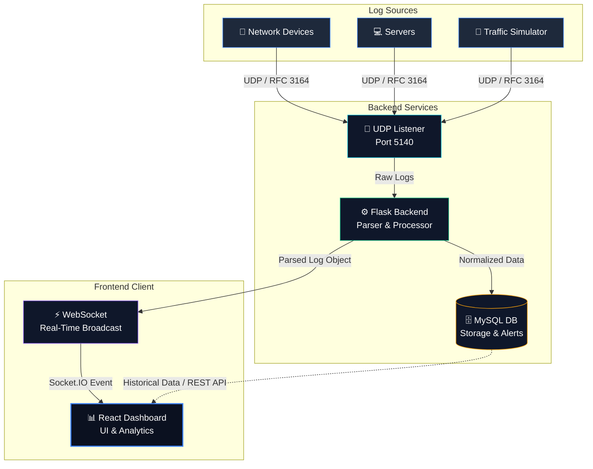

<div align="center">
  
  <h1>🌐 LogSphere Syslog Platform</h1>
  <p><strong>Enterprise-Grade Real-Time Syslog Monitoring & Analytics</strong></p>
  <p>High-performance log ingestion, processing, and visualization for modern IT infrastructure. <br> Inspired by Datadog, Grafana, and Kibana.</p>
  
  <div style="margin-top: 15px;">
    
    
    
    
    
    
  </div>
</div>

<br />

## 🌟 How It Works (System Architecture)

LogSphere is built on a high-performance, real-time pipeline that ingests, processes, and visualizes system logs instantly. 



### 🔄 The Process Flow:
1. **Log Generation (📡):** Devices or the built-in simulator (`syslog_generator.py`) emit standard syslog messages (RFC 3164 format).
2. **Ingestion (🔌):** Transmitted via UDP to the backend listener (`syslog_receiver.py`) operating on port `5140`.
3. **Parsing (⚙️):** The Python backend decodes raw bytes, extracting Timestamp, Hostname, App Name, Facility, Severity, and Message.
4. **Storage (🗄️):** Data is normalized and stored securely in MySQL. Alerts are triggered based on severity rules.
5. **Broadcasting (⚡):** `Flask-SocketIO` instantly pushes the newly parsed log to all connected web clients without polling.
6. **Visualization (📊):** The React frontend instantly renders updates across Live Logs, KPIs, and Charts in a premium glassmorphic UI.

---

## ✨ Key Features

- **⚡ Real-Time Ingestion:** Lightning-fast UDP listening capabilities processing thousands of logs/sec.
- **🔌 Zero-Latency Updates:** WebSockets push data directly to your dashboard—no refreshing required.
- **🎨 Enterprise UI:** Stunning dark-mode, glassmorphism-inspired interface built with TailwindCSS & Framer Motion.
- **🔐 Secure Access:** JWT authentication with robust `Admin` and `Super Admin` Role-Based Access Control (RBAC).
- **📈 Interactive Analytics:** Deep insights using dynamic Recharts visualizations (bar charts, line graphs, pie charts).
- **🚨 Smart Alerts:** Automated alert generation based on log severity with built-in resolution workflows.

---

## 📁 Project Structure

```text
logsphere/
├── frontend/               # React + Vite + TailwindCSS Application
│   ├── src/
│   │   ├── components/     # Reusable UI components
│   │   ├── pages/          # Full page layouts (Dashboard, Live Logs, etc.)
│   │   └── services/       # API and WebSocket client logic
├── backend/                # Python + Flask + SocketIO API
│   ├── routes/             # Modular API blueprints (auth, logs, alerts, analytics)
│   ├── app.py              # Main Flask application initialization
│   ├── models.py           # SQLAlchemy database models
│   ├── syslog_receiver.py  # Background UDP listening thread
│   └── syslog_generator.py # Development script for simulating network traffic
├── database/
│   └── schema.sql          # MySQL database initialization schema
└── README.md
```

---

## ⚙️ Prerequisites

Ensure you have the following installed before proceeding:
- **Python 3.10+**
- **Node.js 18+**
- **MySQL 8.0+**

---

## 🚀 Getting Started

### 1. Database Setup
```sql
-- Start your MySQL server, then initialize the database schema:
mysql -u root -p < database/schema.sql
```

### 2. Backend Setup
```bash
cd backend

# Create and activate virtual environment
python -m venv venv
venv\Scripts\activate       # Windows
# source venv/bin/activate  # Linux/Mac

# Install dependencies
pip install -r requirements.txt

# Configure environment variables
# Create a .env file and set your MySQL password:
# echo "MYSQL_PASSWORD=your_password" > .env

# Run the Flask backend
python app.py
```
> **Backend runs at:** `http://localhost:5000`
> **Default credentials:** `superadmin` / `admin123`

### 3. Frontend Setup
```bash
cd frontend

# Install Node dependencies
npm install

# Start the Vite development server
npm run dev
```
> **Frontend runs at:** `http://localhost:3000`

### 4. Simulating Traffic (Development)
To see data flow through the system, run the traffic generator in a separate terminal:
```bash
cd backend
python syslog_generator.py
```
*This sends realistic RFC 3164 syslog packets to `127.0.0.1:5140` every 0.5–2 seconds.*

---

## 🔐 Authentication & Roles

LogSphere uses JWT (JSON Web Tokens) for secure API access. Tokens expire after **24 hours**.

| Role        | Capabilities |
|-------------|--------------|
| **Admin**       | View logs, manage alerts, view devices, and explore analytics. |
| **Super Admin** | All Admin rights **plus** access to the User Management control panel. |

---

## 🌐 API & WebSocket Reference

### REST API Endpoints
- **Auth:** `/api/auth/login`, `/api/auth/me`, `/api/auth/change-password`
- **Logs:** `/api/logs/`, `/api/logs/recent`, `/api/logs/stats`, `/api/logs/hourly`
- **Alerts:** `/api/alerts/`, `/api/alerts/<id>/resolve`, `/api/alerts/<id>`
- **Analytics:** `/api/analytics/overview`, `/api/analytics/severity-distribution`, `/api/analytics/logs-per-hour`

### WebSocket Events
| Event Name  | Direction       | Payload Description |
|-------------|-----------------|---------------------|
| `new_log`   | Server → Client | Full JSON object containing the newly processed log. |

---

## 🎨 Design System

LogSphere employs a high-end, futuristic enterprise design language:
- **Background Palette:** `#0B1120`, `#111827`, `#0F172A`
- **Accent Colors:** `#3B82F6` (Electric Blue), `#06B6D4` (Neon Cyan)
- **Status Indicators:** `#EF4444` (Critical), `#F59E0B` (Warning), `#10B981` (Success)
- **Typography:** Inter (Google Fonts) for clean, readable data presentation.
- **Aesthetics:** Glassmorphism, subtle gradient borders, soft glow shadows, and fluid Framer Motion animations.

---

## 🛠️ Production Deployment Notes

1. Set `FLASK_ENV=production` and `VITE_API_URL` securely in your `.env` files.
2. Use a robust WSGI server for the backend: `gunicorn --worker-class eventlet -w 1 app:app`
3. Bind the syslog receiver to the standard port **514** (requires root/administrative privileges).
4. Build the frontend for production: `npm run build`, and serve the `dist/` directory via **Nginx**.
5. Ensure strong, randomized secrets are used for `JWT_SECRET_KEY` and `SECRET_KEY`.
